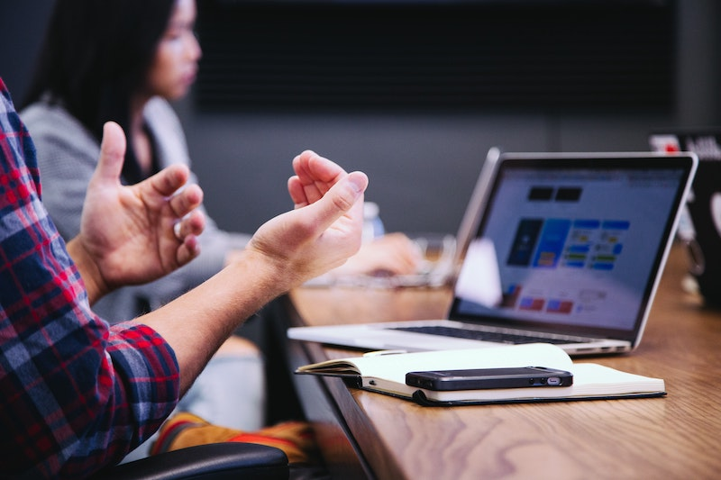

# Velkommen til Digital@BambleVGS

**På denne portalen vil du finne opplæringsmateriell til de viktigste systemene og programmene som brukes av lærere og elever på skolen. Veiledningene vil ta for seg de viktigste funksjonene i programvaren du har tilgjengelig på maskinen og informasjon om hvordan du kan lære deg god studieteknikk og arbeidsflyt**

Alle ansatte og elever på skolen har tilgang til en egen PC. Dette er det viktigste arbeidsverktøyet vi har på skolen. Det er derfor viktig at vi har kan utnytte denne på best mulig måte slik at vi kan jobbe mer effektivt og smartere i skolehverdagen.

:::{figure-md} markdown-fig

Datamaskinen er et fantastisk verktøy i skolehverdagen. (Foto: Unsplash Lisens: Unspalsh)
:::

I tillegg til opplæringsmateriell til programvare og de viktigste ressursene vil det også være temasider om studieteknikk, kildebruk og nettvett. Bruk menyen for å navigere til ønsket innhold.

Lykke til!